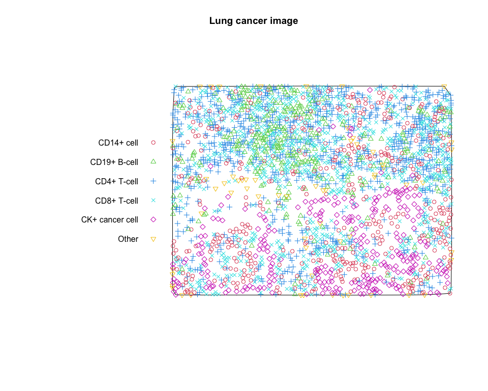
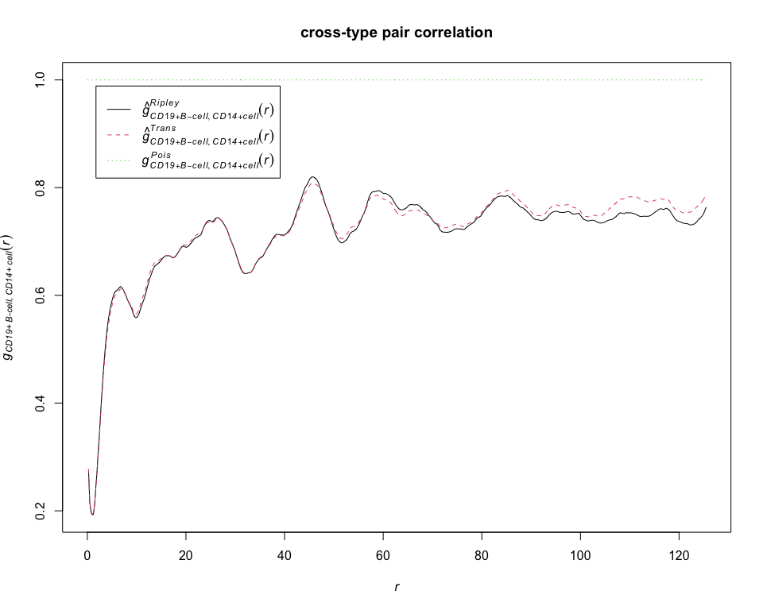
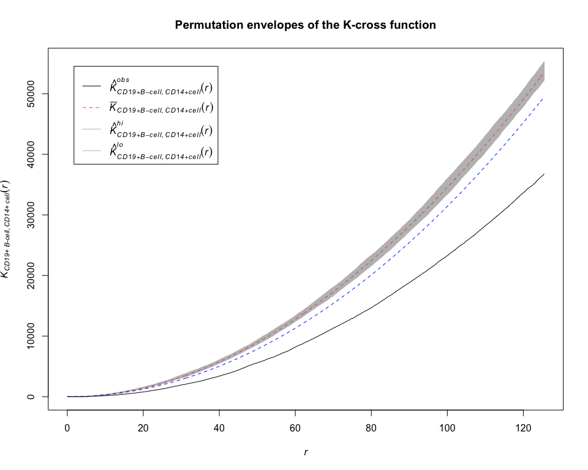

MItools
================

- [Installation](#installation)
- [Example for multitype.pp](#example-for-multitypepp)
- [Example for Kcross](#example-for-kcross)
- [Example for Lcross](#example-for-lcross)
- [Example for pcfcross](#example-for-pcfcross)
- [Example for Gcross](#example-for-gcross)
- [Example for envelope](#example-for-envelope)

The R package `MItools` provides a collection of standard spatial
statistics tools for analyzing multiplexed imaging data.

## Installation

To install the latest version from Github, use

``` r
library(devtools)
devtools::install_github("junsoukchoi/MItools")
```

## Example for multitype.pp

``` r
library(MItools)

# load pre-processed lung cancer data
load(url("https://github.com/julia-wrobel/MI_tutorial/raw/main/Data/lung.RDA"))

# randomly select a lung cancer image and define cell types
library(dplyr)
subj_df = filter(lung_df, image_id == "#73 6-333-711_[44841,18646].im3")
subj_df = subj_df %>%
   mutate(phenotype = case_when(
      phenotype_cd19 == "CD19+" ~ "CD19+ B-cell",
      phenotype_cd14 == "CD14+" ~ "CD14+ cell",
      phenotype_cd8 == "CD8+" ~ "CD8+ T-cell",
      phenotype_cd4 == "CD4+" ~ "CD4+ T-cell",
      phenotype_ck  == "CK+" ~ "CK+ cancer cell",
      TRUE ~ "Other"
   ))

# convert the selected lung cancer image into the object of class "ppp" representing a multitype point pattern
pp_lung = multitype.pp(subj_df$x, subj_df$y, subj_df$phenotype)

# plot the multitype point pattern
plot(pp_lung, main = "Lung cancer image", cols = 2 : 7)
```

<!-- -->

## Example for Kcross

``` r
# calculate estimates of the K-cross function between CD19+ B-cell and CD14+ cell
K = Kcross(pp_lung, "CD19+ B-cell", "CD14+ cell", correction = "all")
plot(K, main = "K-cross")
```

<!-- -->

## Example for Lcross

``` r
# calculate estimates of the L-cross function between CD19+ B-cell and CD14+ cell
L = Lcross(pp_lung, "CD19+ B-cell", "CD14+ cell", correction = "all")
plot(L, main = "L-cross")
```

<!-- -->

## Example for pcfcross

``` r
# calculate estimates of the cross-type pair correlation function between CD19+ B-cell and CD14+ cell
g = pcfcross(pp_lung, "CD19+ B-cell", "CD14+ cell", correction = "all")
plot(g, main = "cross-type pair correlation")
```

<!-- -->

## Example for Gcross

``` r
# calculate estimates of the G-cross function between CD19+ B-cell and CD14+ cell
G = Gcross(pp_lung, "CD19+ B-cell", "CD14+ cell", correction = "all")
plot(G, main = "G-cross")
```

<!-- -->

## Example for envelope

``` r
# compute envelopes of the K-cross function between CD19+ B-cell and CD14+ cell under CSR
envelope_K = envelope(pp_lung, Kcross, funargs = list(i = "CD19+ B-cell", j = "CD14+ cell", correction = "none"))
```

    ## Generating 99 simulations of CSR  ...
    ## 1, 2, 3, 4, 5, 6, 7, 8, 9, 10, 11, 12, 13, 14, 15, 16, 17, 18, 19, 20,
    ## 21, 22, 23, 24, 25, 26, 27, 28, 29, 30, 31, 32, 33, 34, 35, 36, 37, 38, 39, 40,
    ## 41, 42, 43, 44, 45, 46, 47, 48, 49, 50, 51, 52, 53, 54, 55, 56, 57, 58, 59, 60,
    ## 61, 62, 63, 64, 65, 66, 67, 68, 69, 70, 71, 72, 73, 74, 75, 76, 77, 78, 79, 80,
    ## 81, 82, 83, 84, 85, 86, 87, 88, 89, 90, 91, 92, 93, 94, 95, 96, 97, 98, 
    ## 99.
    ## 
    ## Done.

``` r
plot(envelope_K, main = "Envelopes of the K-cross function")
```

<!-- -->

``` r
summary(envelope_K)
```

    ## Pointwise critical envelopes for "K"["CD19+ B-cell", "CD14+ cell"](r)
    ## and observed value for 'Y'
    ## Obtained from 99 simulations of CSR
    ## Alternative: two.sided
    ## Upper envelope: pointwise maximum of simulated curves
    ## Lower envelope: pointwise minimum of simulated curves
    ## Significance level of Monte Carlo test: 2/100 = 0.02
    ## Data: Y
